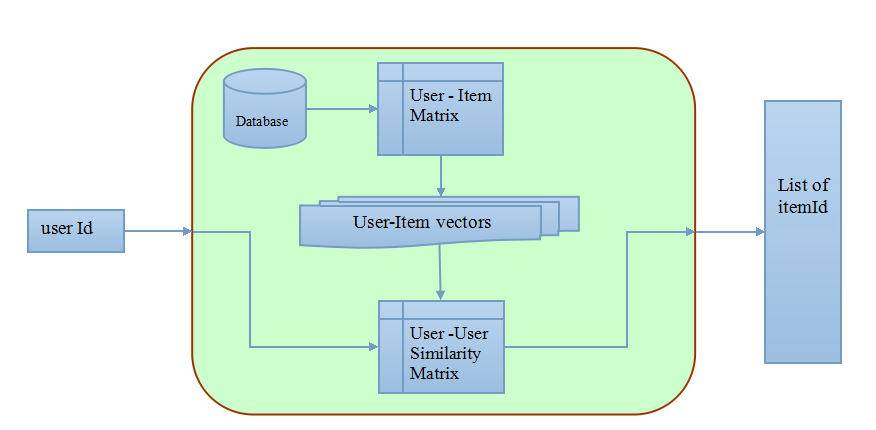
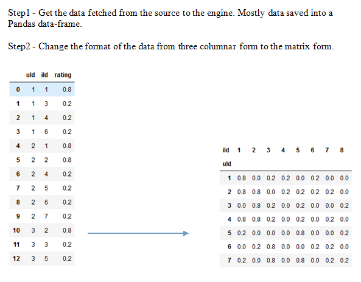
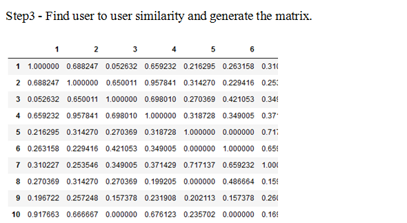
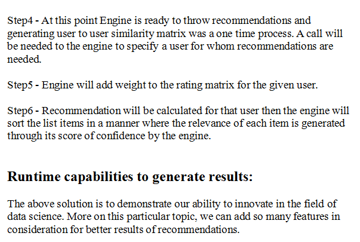
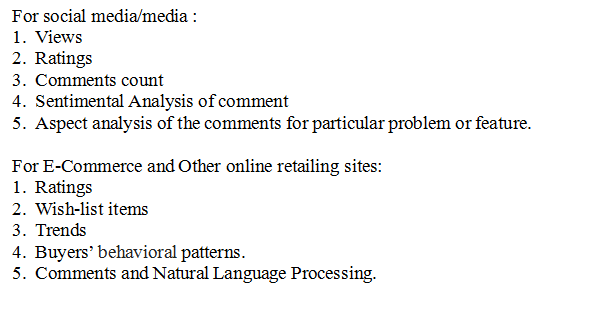

# Recommendation-Systems

## Following diagram represents the core elements of the engine:

# Implementing collaborative filter approach:

<ul>
  <li>The engine consumes data from the database [or CSV] which holds the user-item interactions.</li>

<li>Engine converts the table input from the database to the matrix form where indexes are userId and each column represents an itemId. </li>

<li>Values of the respective cell is the interaction between user and item. This value can vary from one use case to another, it can be ratings, views, likes or no of comments and so on.</li>

<li>Now each row will be treated as a user-vector and this vector contains the interactions of a particular user.</li>

<li>After generating the user-vectors, engine will find the cosine similarities among rest of the users and this process will be repeated for all the users. </li>

<li>User-User similarity matrix will represent the similarity between any two users. This matrix holds all the similar user clusters.</li>

<li>At the time of the generating recommendation, User-User similarity will be multiplied as weight to the User-Item matrix.This new multiplied matrix contains the recommendations. </li>

<li>Threshold will control the amount of data which will be retrieved from the Weighted User-Item matrix. This retrieved data is the list of recommendation.</li>

</ul>

# Demo Case:

Follow the below link for algorithm and theory:
https://en.wikipedia.org/wiki/Item-item_collaborative_filtering
https://patents.google.com/patent/US6266649
